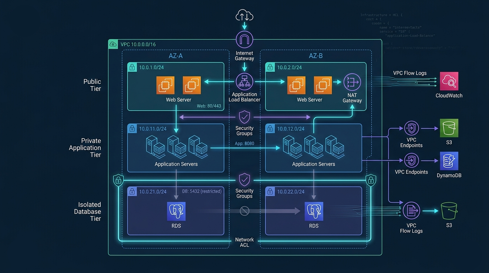

# AWS Secure VPC Terraform

> A production-ready, multi-tier AWS VPC infrastructure built with Terraform — designed with security, modularity, and scalability in mind.



---

## ✨ Features

- **Multi-tier architecture** — Public, Private Application, and Isolated Database subnets across two Availability Zones (AZ-A & AZ-B)
- **High availability** — All tiers are replicated across AZ-A and AZ-B for fault tolerance
- **Least-privilege security** — Dedicated Security Groups per tier (Web: 80/443, App: 8080, DB: 5432 restricted)
- **Network ACLs** — Additional layer of subnet-level traffic control
- **NAT Gateway** — Secure outbound internet access for private subnets, no inbound exposure
- **VPC Endpoints** — Private connectivity to S3 and DynamoDB without traversing the public internet
- **VPC Flow Logs** — Full traffic visibility shipped to CloudWatch and S3 for auditing
- **Application Load Balancer** — Distributes incoming traffic across web servers in both AZs
- **Modular Terraform structure** — Clean separation into `vpc`, `security`, and `logging` modules

---

## 🏗 Architecture Overview

The infrastructure follows a classic **3-tier secure VPC pattern** spanning two Availability Zones:

| Tier | Subnets | Components | Ports |
|---|---|---|---|
| **Public** | 10.0.1.0/24, 10.0.2.0/24 | Web Servers, ALB, NAT Gateway | 80, 443 |
| **Private Application** | 10.0.11.0/24, 10.0.12.0/24 | Application Servers | 8080 |
| **Isolated Database** | 10.0.21.0/24, 10.0.22.0/24 | RDS (PostgreSQL) | 5432 (restricted) |

**Traffic flow:** Internet → Internet Gateway → ALB → Web Servers → App Servers → RDS

**Outbound (private):** App/DB Servers → NAT Gateway → Internet

**AWS service access:** App/DB Servers → VPC Endpoints → S3 / DynamoDB (no public internet)

---

## 📁 Project Structure

```
aws-secure-vpc-terraform/
├── main.tf                        # Root module — ties everything together
├── variables.tf                   # Input variable definitions
├── outputs.tf                     # Output values (VPC ID, subnet IDs, etc.)
├── providers.tf                   # AWS provider configuration
├── terraform.tfvars.example       # Copy and rename to terraform.tfvars
├── .gitignore
├── modules/
│   ├── vpc/                       # VPC, subnets, IGW, NAT GW, route tables
│   ├── security/                  # Security Groups & Network ACLs
│   └── logging/                   # VPC Flow Logs → CloudWatch & S3
└── README.md
```

---

## 🛠 Prerequisites

- Terraform `>= 1.5`
- AWS CLI configured (`aws configure`)
- IAM user/role with permissions for: VPC, EC2, RDS, CloudWatch, S3, IAM

---

## 🚀 Getting Started

**1. Clone the repository**

```bash
git clone https://github.com/syedshaaharham/aws-secure-vpc-terraform.git
cd aws-secure-vpc-terraform
```

**2. Configure your variables**

```bash
cp terraform.tfvars.example terraform.tfvars
# Edit terraform.tfvars with your values (region, CIDR blocks, etc.)
```

**3. Initialize Terraform**

```bash
terraform init
```

**4. Review the execution plan**

```bash
terraform plan
```

**5. Deploy the infrastructure**

```bash
terraform apply
```

---

## 📦 Modules Overview

### `vpc`
Creates the core network infrastructure:
- VPC with DNS support enabled
- Public, private, and database subnets across two AZs
- Internet Gateway for public tier
- NAT Gateway for private tier outbound access
- Route tables and subnet associations

### `security`
Defines all access controls:
- Security Group for Web tier (inbound 80/443 from ALB)
- Security Group for App tier (inbound 8080 from Web SG only)
- Security Group for DB tier (inbound 5432 from App SG only)
- Network ACLs as a secondary control layer

### `logging`
Enables full traffic observability:
- VPC Flow Logs for all subnets
- CloudWatch Log Group for real-time monitoring
- S3 bucket for long-term log archival

---

## ⚠️ Security Notes

- **Never commit** `terraform.tfvars` — it contains sensitive values. It is already in `.gitignore`
- For production, configure a **remote backend** (S3 + DynamoDB state locking) instead of local state
- The database tier has **no route to the internet** — access is restricted to the App SG only
- VPC Endpoints for S3 and DynamoDB eliminate the need for public internet access from private subnets
- Review CIDR blocks and security group rules before applying in your environment

---

## 🔮 Potential Enhancements

- [ ] AWS WAF in front of the ALB
- [ ] AWS Shield for DDoS protection
- [ ] AWS Secrets Manager for RDS credentials
- [ ] GuardDuty for threat detection
- [ ] Remote Terraform backend (S3 + DynamoDB)
- [ ] Multi-region replication

---

## 🤝 Contributing

Contributions, issues, and feature requests are welcome. Feel free to open a PR or issue.

---

## 📄 License

MIT License — free to use, modify, and distribute.

---

*Built by [Syed Shaharham](https://github.com/syedshaaharham)*
